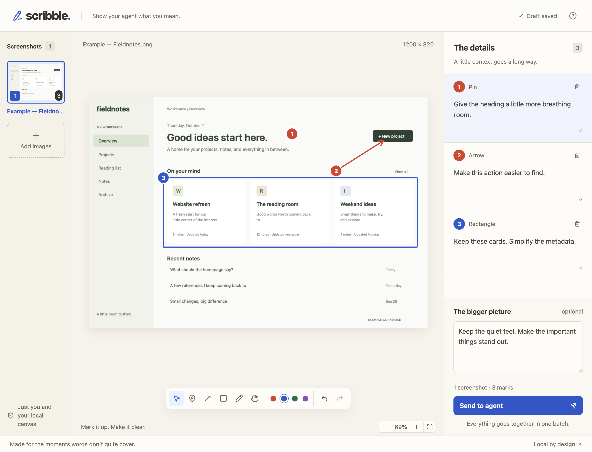

# Scribble

**Show your agent what you mean.**

Scribble is a local browser canvas for visual feedback to Codex and Claude Code. Screenshots, marks, and comments show your agent what to change. Upload images or capture a webpage or simulator screen.

No account, hosted backend, or model API key is required.



## Install

Scribble requires **Node.js 22 or newer**. The skill includes the browser app and server. Screenshot uploads need no separate build or dependency installation. Live capture uses optional tools, described below.

From your project directory, run:

```sh
npx skills add tguidon/scribble
```

The installer offers a choice of agents and installation scope. The repository contains one skill, so `--skill scribble` is optional.

To select Codex and Claude Code directly, run:

```sh
npx skills add tguidon/scribble --agent codex claude-code
```

Add `--global` to install across projects. The [skills CLI documentation](https://github.com/vercel-labs/skills) lists all installation flags.

### Test a fixed release

The `0.0.2` release supports screenshot uploads. Live capture is available from the default branch.

To install the `0.0.2` release:

```sh
npx skills add https://github.com/tguidon/scribble/tree/v0.0.2/skills/scribble
```

This uses the skills CLI’s [direct repository path format](https://github.com/vercel-labs/skills#source-formats). Use a release tag to keep tests on a fixed version; the shorter install command follows the repository’s default branch.

## Use Scribble

1. Run **`$scribble` in Codex** or **`/scribble` in Claude Code**.
2. Open the session link from your agent.
3. Upload, paste, or drag screenshots onto the canvas. To capture a running app, select **Capture live app**.
4. Add pins, arrows, rectangles, or freehand marks.
5. Add a comment to each mark that needs an explanation.
6. To describe the overall goal, add a message for the session.
7. Select **Send to agent**.

The agent receives your screenshots, mark positions, and comments in one feedback bundle. The canvas also supports undo, redo, zoom, and pan.

## Capture a running app

Direct webpage capture works best with local apps. For hosted sites, existing logins, or human-verification checks, use **Share browser tab**.

Scribble saves each capture as a still image in the same annotation editor. Your app keeps running. Later captures do not change earlier images or marks.

### Set up capture tools

Selecting **Open webpage** or **Connect simulator** installs missing tools automatically. The first download can take a few minutes.

To install the tools ahead of time, run the relevant command from this repository:

```sh
node bin/scribble.mjs setup web
node bin/scribble.mjs setup simulator
```

For an installed skill, replace `bin/scribble.mjs` with the absolute path to its `scripts/scribble.mjs` file. If you use custom storage, pass the same `--dir PATH` to setup and startup.

- **Webpage:** Setup installs Playwright and downloads Chromium. The browser runs in the background and streams its viewport into Scribble.
- **Simulator:** Setup installs serve-sim. Capture requires an Apple Silicon Mac, Xcode, and a booted simulator. Scribble also accepts serve-sim on `PATH`.

The optional packages live in `.scribble/capture-runtime/`. Chromium uses Playwright’s browser cache. Setup requires internet access. Scribble stores captured images and feedback locally.

### Capture a webpage

1. For a local app, start its development server.
2. Select **Capture live app**, then **Webpage**.
3. Enter a URL, or select an app under **Running on this Mac**.
4. Select **Open webpage**.
5. Click, scroll, or type in the embedded live screen.
6. Select **Capture & annotate**.

Scribble streams a browser viewport directly into its canvas. This also works with pages that block iframe embedding. Use the back and reload controls above the screen to navigate. Each capture records the URL, page title, viewport dimensions, scroll position, and capture time.

The capture browser has a separate temporary profile. It does not share your normal browser’s logins. Public and local HTTP or HTTPS URLs are supported. You can enter `example.com` or `localhost:3000` without a scheme. File URLs and URLs with embedded credentials are rejected.

Scribble checks local development-server ports and lists those that return HTML. Select **Refresh sources** after starting another app. If automatic discovery is unavailable, enter the URL directly.

### Share a browser tab

1. Open the Scribble session link in Chrome or Edge.
2. Open the website in another tab. Sign in or complete verification there.
3. In Scribble, choose **Capture live app → Webpage → Share browser tab**.
4. Select **Share browser tab**, then choose the website’s tab in the browser picker.
5. Navigate in the original tab. Its live picture appears in Scribble.
6. Select **Capture & annotate** to save a still image.

Sharing is view-only inside Scribble. It requires no browser automation tools or extension. The live stream stays in your browser; captured frames are saved to the local Scribble server. Audio is not requested.

Sharing stays active while you annotate. Use **Return to shared tab** for another capture, or **Stop sharing** to end it. Submitting feedback or closing the tab ends sharing. After a reload, choose a tab again. Browsers without screen-sharing support show **Copy session link** so you can continue in Chrome or Edge.

If you select a window or screen instead of a tab, Scribble labels it accordingly. Shared captures record the surface type, dimensions, and capture time. The browser does not provide the website URL or scroll position through this flow.

### Capture a simulator

1. Launch your app in Simulator.
2. Select **Capture live app**, then **Simulator**.
3. Choose a booted device and select **Connect simulator**.
4. Tap or drag directly on the simulator screen inside Scribble.
5. Select **Capture & annotate**.

Scribble reuses or starts serve-sim for the selected device and embeds only its screen. The Home control returns to the simulator home screen. Each capture records the device, orientation, capture time, and app identifier when available.

Click the embedded screen before typing, or expand **Type or paste text**. Press Escape to return keyboard control to Scribble. Simulator text input supports US keyboard characters; use the simulator’s on-screen keyboard for other text.

Direct webpage and simulator views pause when the Scribble tab is hidden and stop when you return to annotations. **Reconnect** restores the selected live view. The stream and input requests use the same session authentication as saved feedback.

### Simulator input with Xcode 27

Device Hub can disable the legacy input path used by serve-sim. Scribble detects this state and keeps capture available while disabling touch and keyboard controls. The repair closes running simulator apps, so the agent must ask before running it. After repair and relaunching your app, select **Reconnect**.

### Continue a review

Select **Resume live capture** to return to a source and capture another screen. Add marks and comments in the editor, then select **Send to agent**. The feedback bundle and brief include each image’s capture context.

**Close webpage** closes the temporary browser and clears its login state. **Disconnect simulator** leaves the simulator and shared serve-sim preview running. Source connections end when Scribble stops; saved images and feedback remain available.

## Sessions and saved drafts

The agent runs the skill only after an explicit request. The launcher sends an authenticated request to the local server. If the server responds and runs the installed version, the launcher reuses it. If its version differs, the launcher requests an authenticated shutdown and starts the installed version on the same port. If no server process is running, it starts one in the background. If a recorded process is still alive but does not respond, the launcher asks you to retry or stop that process before restarting.

The latest unfinished draft resumes automatically. After submission, the next skill request recovers any feedback the agent has not acknowledged. The agent reads the bundle and images, then marks it as read with `ack --session ID`. Reading with `wait` or `feedback` alone does not clear it. Once all submissions are acknowledged, the next request opens a new session on the same server. The server remains available for later sessions.

Scribble saves drafts and screenshots in `.scribble/` in your project. On startup, it adds the storage directory to Git’s local `info/exclude` file. This keeps screenshots, feedback, and session tokens out of new commits without changing your shared `.gitignore`. Custom storage directories inside a Git repository receive the same protection. If storage files are already tracked, startup stops and asks you to remove them from Git’s index. A browser backup stores unsaved edits to marks and messages. Saved work remains available after the agent or server stops.

Each project has a separate server and storage directory. A startup lock coordinates launchers. A lifetime lock gives one server ownership of the storage directory. Slow uploads do not block health checks or other sessions. The server accepts connections only at `127.0.0.1`. Screenshots and feedback require a session token.

### Server and browser versions

If capture reports that the server is too old, run the Scribble skill again and reload the browser tab. The launcher upgrades versioned servers automatically. Pre-versioning servers require your agent to inspect and stop the reported process first. Saved drafts remain available. A version check now identifies this condition before capture, instead of showing a generic “Not found” error.

### Recover a draft

- If a save fails, select **Retry save**. Keep the tab open until **Draft saved** appears.
- To resume a saved draft, run the skill again.
- If a save response is lost, **Retry save** safely repeats that save before saving newer edits. Reloading also recovers the newer browser draft when Scribble can identify the saved request.
- If another tab saves a conflicting draft, reload the page. Select **Download unsaved draft** to keep your local edits, then **Use saved draft** to continue with the server version. Scribble preserves the backup until you make this choice.

Undo and redo apply to marks and text. They do not apply to screenshot uploads or removal. Screenshot removal excludes the image from the draft but preserves the original file on disk.

## Limits

| Item | Limit |
| --- | --- |
| Screenshots | 30 per session |
| Image formats | PNG, JPEG, WebP |
| Image size | 20 MB and 40 megapixels per image |
| Marks | 500 per image |
| Freehand points | 5,000 per drawing |
| Comment length | 10,000 characters |
| Overall message | 20,000 characters |
| Combined draft | 4 MB of UTF-8 JSON for marks, text, and screenshot metadata; original image files are separate |

If an edit would exceed the combined limit, Scribble keeps the previous valid draft and explains how to reduce it.

## Development

From this repository, run:

```sh
npm install
npm run dev
```

Open the full session URL from the terminal. Keep the token after `#` in the URL.

| Command | Purpose |
| --- | --- |
| `npm run build` | Run TypeScript checks and build the browser app |
| `npm start` | Run the built app and open the browser |
| `npm test` | Run server, storage, and launcher tests |
| `npm run test:e2e` | Run browser tests with an installed Google Chrome |

The complete skill is in `skills/scribble/`. The core server uses only Node built-ins. Optional capture adapters load Playwright or call serve-sim. Vite writes the browser build to `skills/scribble/app/`. The skills installer copies these files without a build step.

After UI changes, run `npm run build`. Then commit the updated `skills/scribble/app/` directory with the source changes.

### Publish a version

Keep `package.json`, the root entries in `package-lock.json`, and `skills/scribble/version.json` on the same version. The tests check that they agree. The installed server reads the bundled version file without needing the development package.

Build and test, commit the changes, then tag that commit as `vVERSION` and publish its GitHub release. Keep published tags fixed so a tagged installation remains reproducible.

## Command reference

In this repository, use `node bin/scribble.mjs` as the command prefix.

For an installed skill, use `node /absolute/path/to/skills/scribble/scripts/scribble.mjs` as the command prefix.

| Command | Behavior |
| --- | --- |
| `start --detach --no-open` | Start or reuse the server and return the session URL as JSON |
| `start --new` | Create a separate draft without clearing unread feedback |
| `start --session ID` | Open a saved draft or submission |
| `wait --session ID --timeout 60` | Wait for submission and return a feedback brief, with exit code 2 on timeout |
| `feedback --session ID` | Read a saved submission as a feedback brief |
| `feedback --session ID --full` | Read the full JSON, including every drawing point; also supported by `wait` |
| `ack --session ID` | Mark submitted feedback as read after inspecting its images |
| `status` | Show the latest session, unread feedback, and recorded server version and process |
| `stop` | Shut down the authenticated server and preserve saved feedback |
| `setup web` | Install Playwright and Chromium for webpage capture |
| `setup simulator` | Install serve-sim for simulator capture |
| `--version` | Print the installed version |

Common flags are `--dir PATH`, `--port NUMBER`, and `--title TEXT`. The default port is 0, which selects an available port. Background server logs are in `.scribble/server.log`.

If separate agents need independent sessions, use a separate `--dir` for each agent.

### Stop or update

Before stopping or updating, wait for **Draft saved** in open browser tabs.

```sh
node bin/scribble.mjs stop
```

For an installed skill, use its absolute script path as described above. Pass the same `--dir` if you use custom storage. Repeating `stop` is safe. Saved drafts and submissions remain on disk.

To update the skill, run `npx skills add tguidon/scribble` again. The next launch compares versions and restarts the server when needed. The restart keeps the same port, so browser backups remain on the same origin. Reload open tabs after the restart to load the updated app.

Servers from before versioning was added need a one-time manual stop. The launcher reports the PID; inspect that process before stopping it with your process manager. The launcher does not stop a process it cannot authenticate.

Agent sandboxes can require permission to open a local port or start a background process.

## Feedback format

Each session contains `session.json` and original screenshots in `images/`. Submission creates a `feedback.json` file that remains unchanged.

By default, `wait` and `feedback` generate a Markdown brief in `feedback.md` and return its text, its path, and the full JSON path. This also works for older submissions. The brief puts the overall request first, followed by each screenshot and its numbered marks. It includes:

- Original image paths, dimensions, and exact comments.
- Mark locations and bounds in pixels and percentages of the image size.
- Arrow starts, tips, and directions.
- Freehand bounds and an approximate outline of at most 16 points, with its maximum point deviation in pixels. Full drawing points stay in the JSON.
- The smallest rectangle containing each pin or arrow tip, including its boundary.

Region labels describe the mark's bounds center within a 3 × 3 image grid. Spatial relationships describe geometry; they do not infer a requested change. The agent still inspects the original images. No images are rendered or sent to an external service to create the brief.

Use `--full` with `wait` or `feedback` to return the original JSON instead of the brief.

The feedback bundle contains:

- The session ID, title, submission time, and overall message.
- Each screenshot's path, name, dimensions, and MIME type.
- Each mark's type, color, points, comment, and number within its screenshot.

Coordinates use **original image pixels from the top-left corner**. Zoom and pan do not change these coordinates. Pins have one point. Arrows and rectangles have endpoints. Freehand marks have ordered points.

The browser download contains JSON. Its image paths refer to files on the same computer.

The example screenshot shows a fictional workspace. Scribble creates it locally without external images or customer data.
